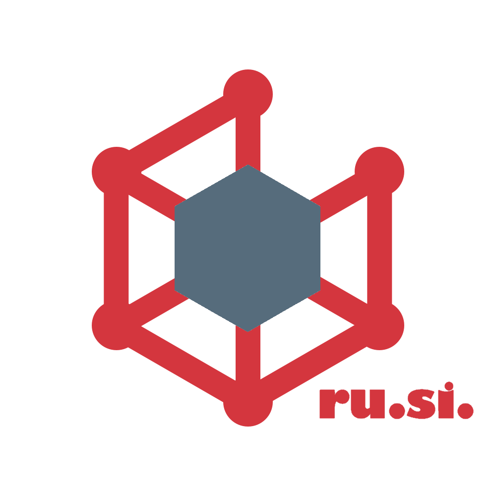

rusi
===============
>Runtime Sidecar - a [Dapr](https://github.com/dapr/dapr) inspired story



## Contributing on windows

- Install Go: 
  - Download Go for windows; Go 1.17
- Editor: 
  - Visual studio Code + Go extension
- Build: 
    - install make
        ```shell
        choco install make
        ```
    - install protoc
        ```shell
        choco install protoc
        ```
    - build with make
        ```shell
        make build-linux
        ```
- Debug: 
    - install delve debug tool: dlv-dap - suggested by vs-code
    - debug with vscode :> Run sidecar
	
## Usage

### Configure Components

In self-hosted mode, component files have to be saved on the local machine, and provide a `components-path` to the sidecar.
In Kubernetes mode Rusi will query the kubernetes api in order to find and register all components   

1. Create a pub/sub message broker component 
    ```yaml
    apiVersion: rusi.io/v1alpha1
    kind: Component
    metadata:
      name: natsstreaming-pubsub
    spec:
      type: pubsub.natsstreaming
      version: v1
      metadata:
      - name: natsURL
        value: "replace with your host"
      - name: natsStreamingClusterID
        value: "replace with your cluster name"
        # below are subscription configuration.
      - name: subscriptionType
        value: queue # Required. Allowed values: topic, queue.
      - name: ackWaitTime
        value: "" # Optional.
      - name: maxInFlight
        value: "1" # Optional.
      - name: durableSubscriptionName
        value: "" # Optional.
    ```
   
2. Add custom middlewares (optional)
    ```yaml
    apiVersion: dapr.io/v1alpha1
    kind: Component
    metadata:
      name: uppercase
    spec:
      type: middleware.http.uppercase
      version: v1
    ```
3. Configure middleware pipeline (optional)
    ```yaml
    apiVersion: rusi.io/v1alpha1
    kind: Configuration
    metadata:
      name: node-pipeline-config
    spec:
      subscriberPipeline:
        handlers:
        - name: pubsub-uppercase
          type: middleware.pubsub.uppercase
          # add other middlewares
      publisherPipeline:
        handlers:
          - name: pubsub-uppercase
            type: middleware.pubsub.uppercase
          # add other middlewares
    ```
### run rusi 
 - kubernetes 
```shell
go run cmd/rusid/sidecar.go --mode kubernetes --app-id your-app-id --config "kube-config-resource-name"
```
If you run out of cluster, it will use your kubectl current context, to scan for all components in all namespaces. 
 - standalone
```shell
go run cmd/rusid/sidecar.go --app-id your-app-id --components-path="path-to-components-folder" --config "path-to-config.yaml"
```
